# ACS_Memory
A repository to hold the findings of an investigation of memory latency vs. throughput using Intel's Memory Latency Checker (MLC) tool and Flexible IO Tester (FIO).

# Objective
To conduct an impromptu investigation into the effects of block size and read write ratio and how they relate to throughput and latency in memory and storage devices.

# Theory
The theoretical relationship between number of requests, throughput, and latency are well defined by Little's law.

L = λW

From Wikipedia:
"[Little's Law] is a theorem by John Little which states that the long-term average number L of customers in a stationary system is equal to the long-term average effective arrival rate λ multiplied by the average time W that a customer spends in the system." [Read more here.](https://en.wikipedia.org/wiki/Queueing_theory)

Though the description above mentions customers, the lemma also has implications in computer science, particularly when dealing with accesses to storage and memory devices.  When a computer issues a write to a hard disk or SSD, the request is put into a queue where it waits to be processed.  Little's Law forms a pillar of a branch of study called Queueing Theory.  When one has an idea of the theory at play with their storage and memory devices, a particular computing environment's resources can be better utilized by understanding the tradeoff at play.

# Procedure
Storage and Memory devices will be tested with various parameters using Intel's Memory Latency Checker [(MLC)](https://www.intel.com/content/www/us/en/developer/articles/tool/intelr-memory-latency-checker.html) and Flexible IO Tester (FIO) by [Jens Axboe](https://github.com/axboe/).

# Hardware
All tests conducted on a Lenovo Thinkpad T480s.

See https://psref.lenovo.com/syspool/Sys/PDF/ThinkPad/ThinkPad_T480s/ThinkPad_T480s_Spec.PDF

8x: Intel(R) Core(TM) i7-8550U CPU @ 1.80GHz, 2000 MHz
8GB DDR4
M.2 SSD / PCIe NVMe, PCIe 3.0 x 4, 32Gb/s

## Testing Memory
Intel MLC allows you to directly test injection delay and measure it against throughput and latency.  It additionally allows you to change the block size for reads and writes, as well as the read/write ratio.  Block sizes of 64B and 256B are used as well as read write ratios of 2:1, 3:1, 1:1.

## Memory Test Results
The following graphs relate latency to throughput for a variety of read-write ratios. Notice the inverse proportional relationship between injection delay and throughput.  This corresponds directly to Little's law.  A greater injection delay leads to a lower Lambda, which decreases throughput performance.  All graphs have the same scale and therefore can be compared.  The left hand y-axis denotes throughput, the right hand y-axis denotes access latency.

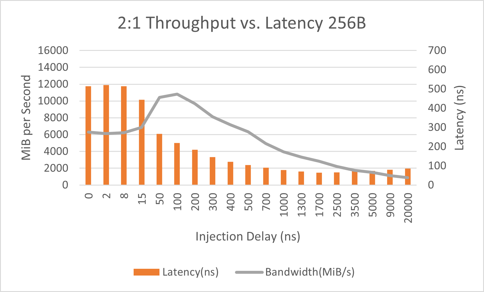
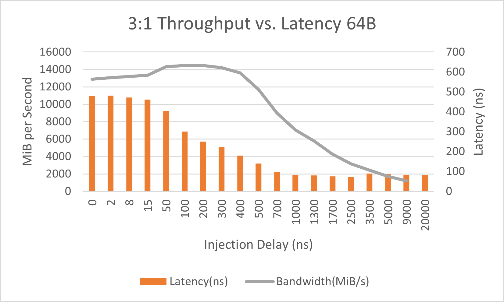
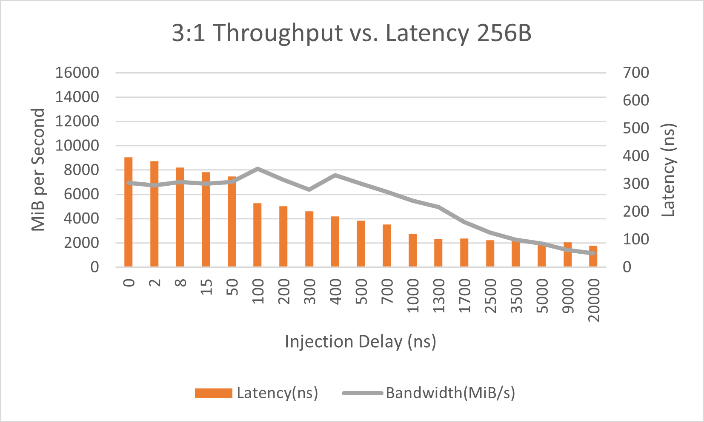
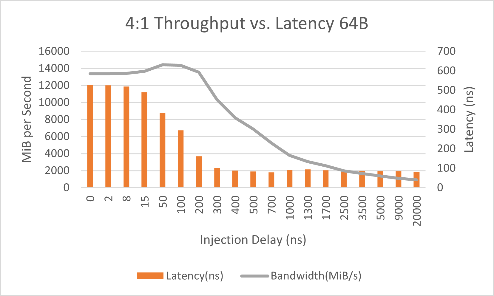
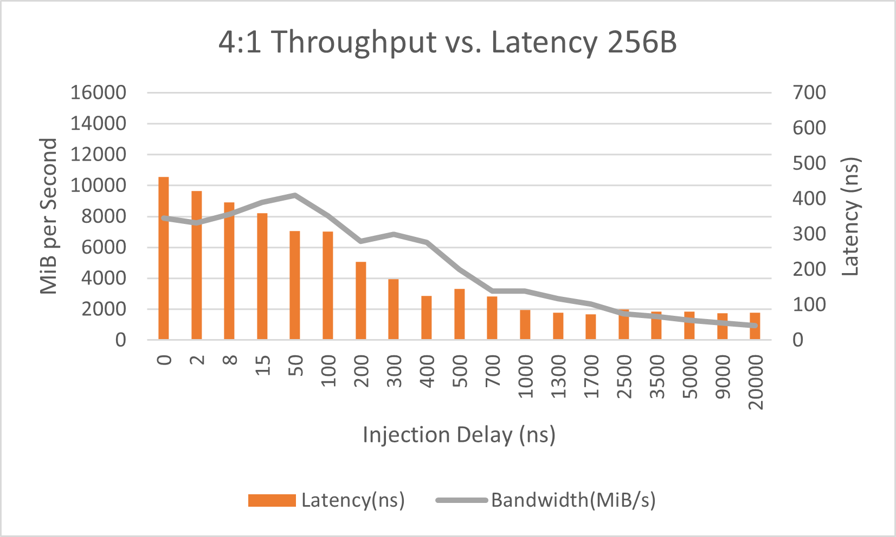
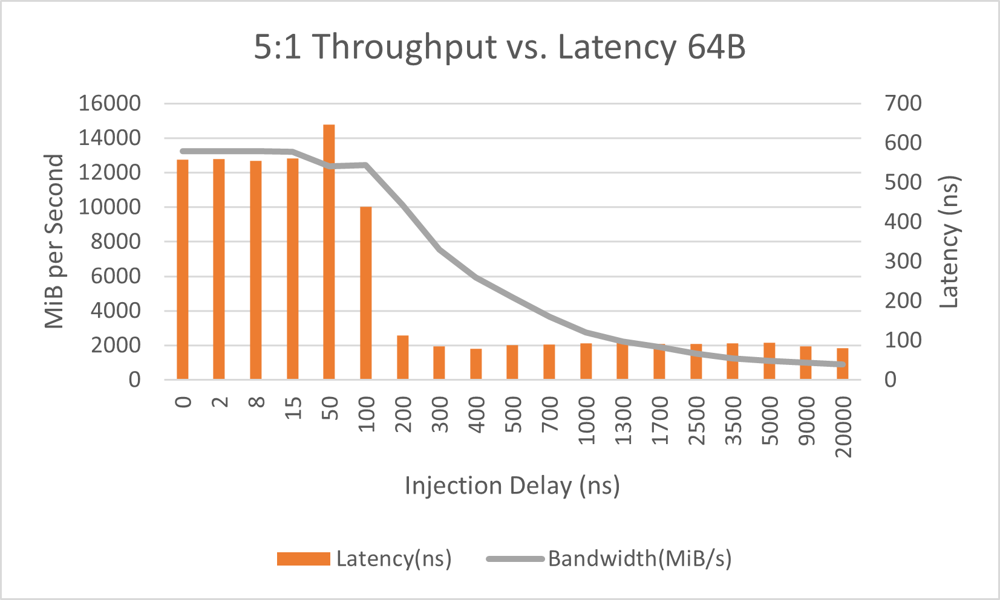
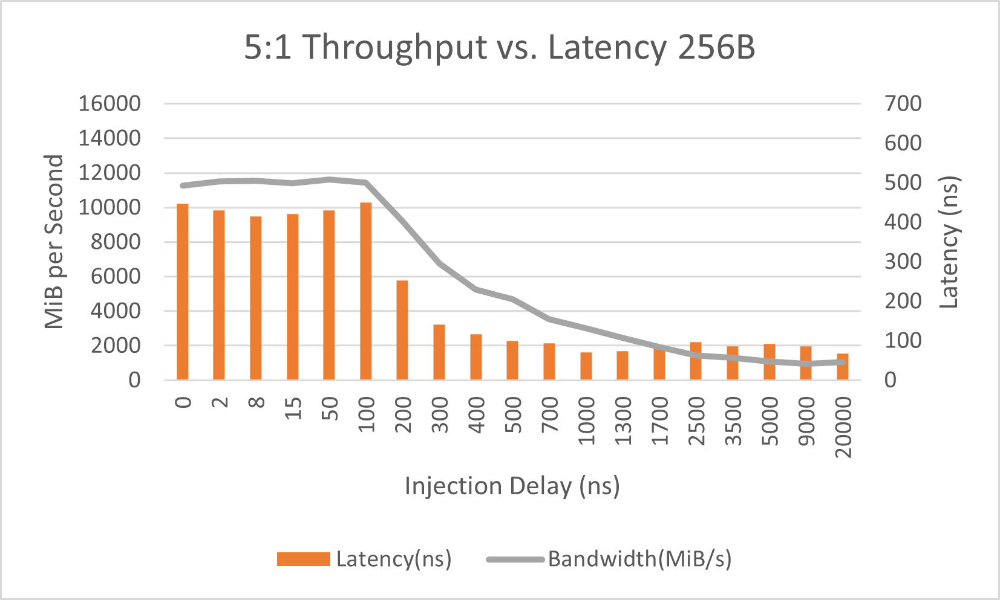

## Memory Test Conclusions
The results yielded by this investigation clearly show the tradeoffs involved between throughput and latency in a memory device.  In memory intensive applications, the way that a programmer accesses memory can have a huge result on their overall computation time as memory overhead in modern CPUs is much greater than instruction overhead.  An application that constantly reads and writes to memory is a performance liability on modern architecture and measures must be taken to minimize this overhead.  Using MLC to profile the system's memory may yield more interesting results than simply throughput vs. latency, however, its main purpose is to observe the tradeoff discussed above and make decisions based upon application behavior.

## Future Applications (Memory Profiling)
Overall, in the opinion of the author, MLC should only be used to increase application performance if bottlenecks are apparent and compiler optimizations do not help.  MLC may provide a window into best-case performance for memory devices that is not readily apparent from statistics gathered within an application.

## Testing SSD
FIO allows you to specify a wide variety of tasks to perform on a given storage device.  The tests conducted herein manipulate the block size between 4KB, 32KB, and 128KB and also tests read write ratios of read-only, 1:1, 2:1, 3:1, and 4:1

## SSD Test Results
The following graphs relate the read-write ratio and IO size to the average latency for each respective block size.  Each graph has the same scale to allow for comparison.  In all cases, 32KB block size turns out to be the best performance amortized over block size.

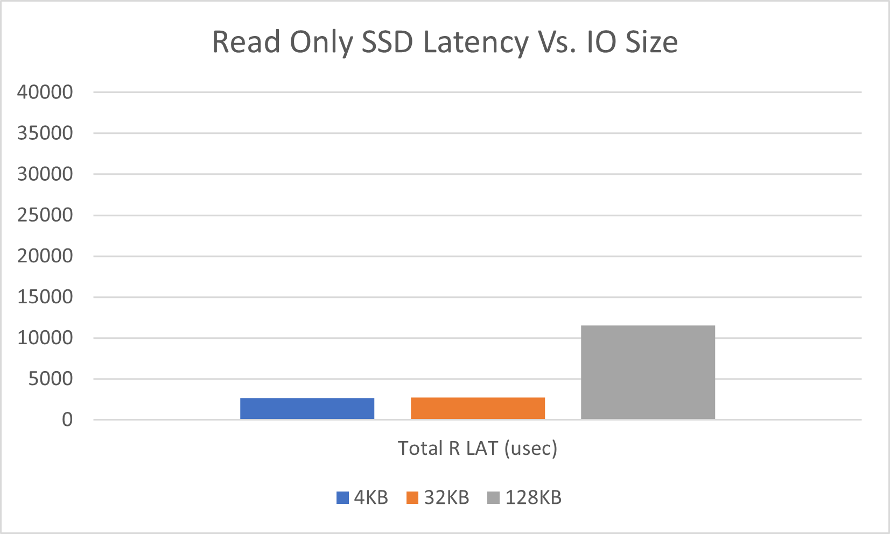
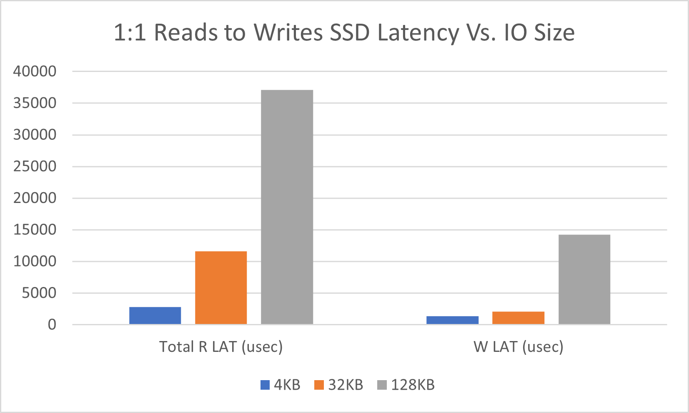
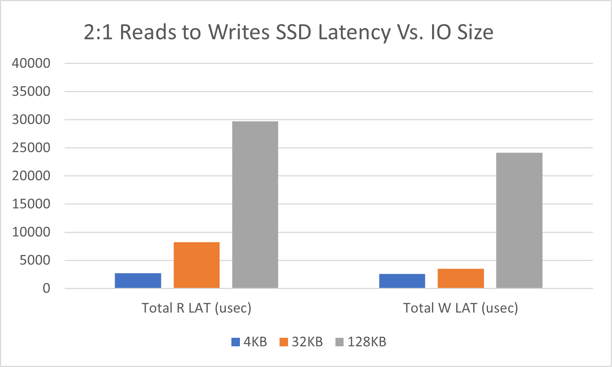
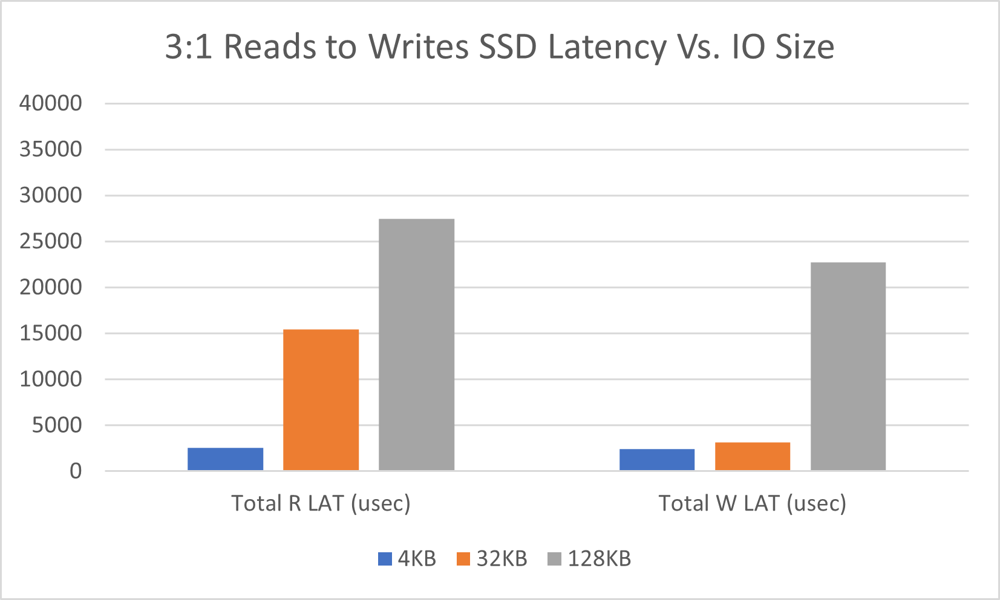
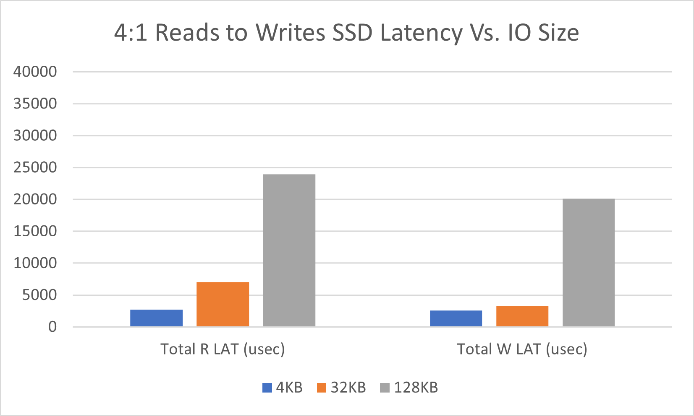

The next section of graphs interpret the same trials as above but instead relate the throughputs and latencies of each trial.  There are two superimposed series, one corresponds to read, the other to write.  The best performance achieved is denoted by the greatest throughput to latency ratio, which corresponds to having large X and small Y.  As can be seen in the trials above, 32KB block size wins in every scenario.

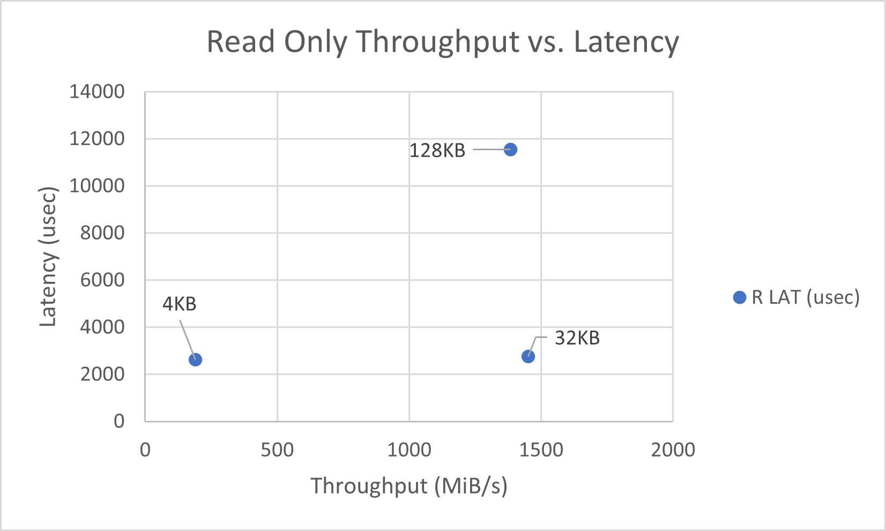
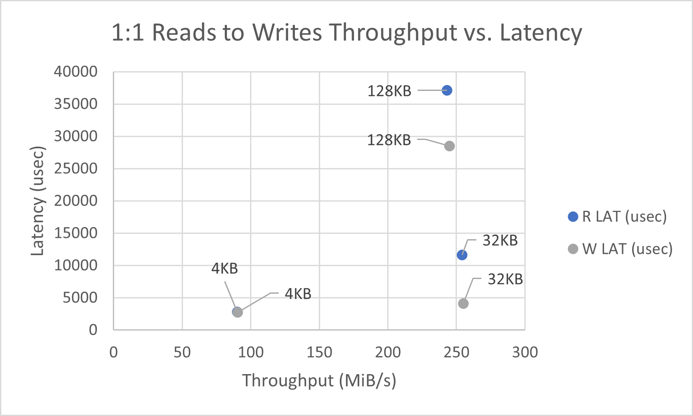
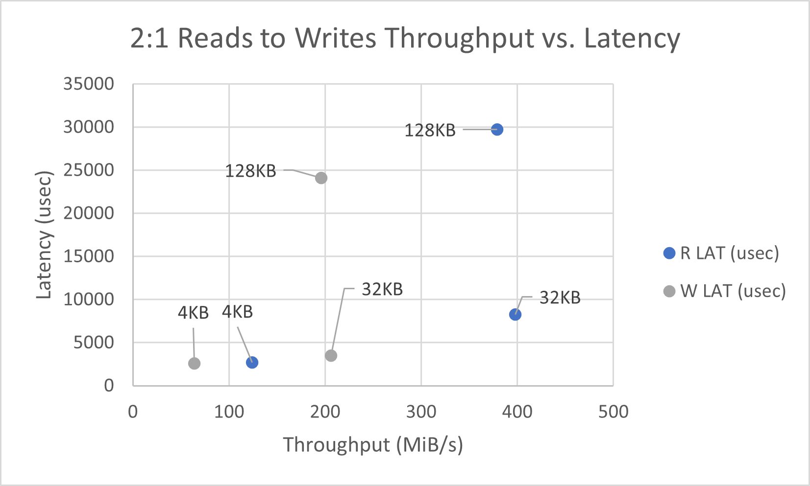
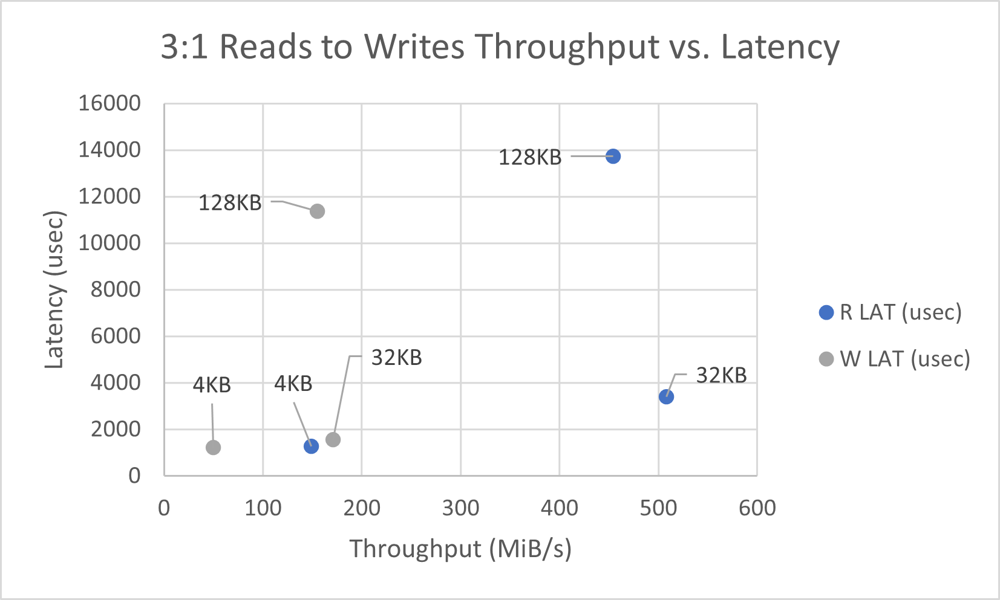
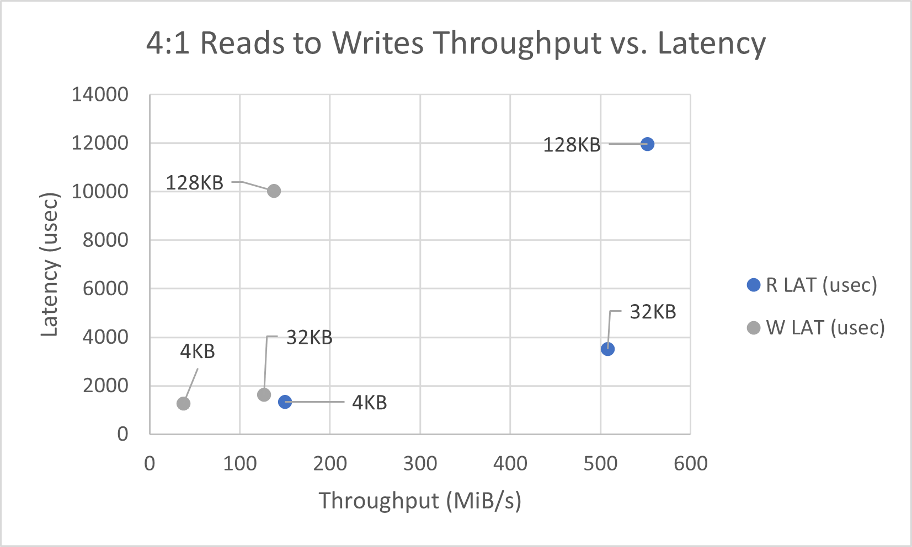

In the above graphs, one may observe the tradeoff in throughput for increasing the read to write ratio.  As the ratio increases, it is clear that write performance suffers as the W LAT values have much smaller throughput when the ratio increases.

### SSD Testing Conclusions
The second set of graphs above demonstrates the tradeoff between throughput and latency.  As block size increases, so does the latency associated with the access.  However, this investigation also yields a non-linear correlation between access size and latency.  It is very clear from the numbers that 32KB access size is the local maxima for performance, especially under higher read-write ratio.  This is not necessarily the case for other platforms and use cases, simply for the machine under test.

### Future Applications (SSD Profiling)
For storage intensive applications, profiling the storage device in use can provide very great detail about possible areas for improving performance.  For example, if one were to use 32KB blocks vs. 128KB blocks on the system under test, one would almost always observe a noticable improvement in performance when 32KB blocks.  Likewise, in some applications, 4KB would be preferable to 32KB. The performance benefits that can be achieved by varying the block size are non-negliglible and should be investigated each time the programmer finds himself in need of extra performance from storage.
